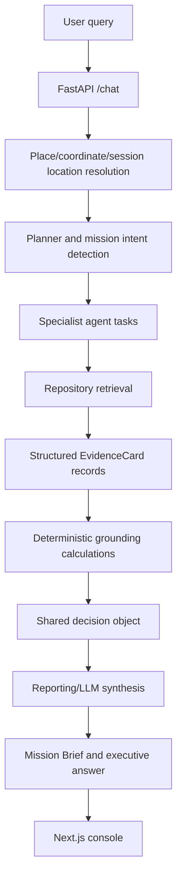

# ORCA Architecture

## 1. Purpose

ORCA is an evidence-grounded marine intelligence system. It accepts a natural-language marine question, resolves the mission and location, activates specialist agents, retrieves structured evidence, performs deterministic grounding calculations, and asks the reporting layer to synthesize a concise decision.

The system is designed for local, no-Docker execution first. SQLite is the default local evidence store. PostgreSQL/PostGIS and provider-backed ingestion remain optional deployment paths.

The central product promise is:

> Every recommendation has a location, a reason, an evidence trail, an uncertainty statement, and conditions that could change the decision.

## 2. Non-negotiable pipeline



The pipeline must not be replaced with query-specific answer branches. Deterministic code is used for distance, useful-range eligibility, temporal validity, risk-component calculations, coverage, provenance, deduplication, ranking features, and scenario perturbations. The recommendation narrative remains a reporting/synthesis responsibility.

## 3. Runtime components

### 3.1 FastAPI API

Main entrypoint: `src/orca/api/main.py`

Public routes:

- `GET /health`: reports service status, selected database mode, and LLM provider availability.
- `POST /chat`: the public path used by the frontend.

`/chat` performs the following work:

1. Validates the request using `ChatRequest`.
2. Resolves location using explicit place names first, then supplied coordinates, then session location, then the default local location.
3. Reuses response cache entries for the same normalized query and resolved location.
4. Runs the orchestration graph.
5. Deduplicates evidence by persisted `(table, id)` identity, with a generated-card fallback identity for no-data records.
6. Runs the reporting synthesis layer.
7. Returns the executive answer, shared Mission Brief fields, evidence, map data, trace, risk decomposition, coverage, lineage, and resolved location.

### 3.2 Session store

`src/orca/api/session_store.py` stores the last location, conversation turns, and response cache in the API process. A follow-up question without coordinates can reuse the previous session location. An explicit place in a new query overrides stale session coordinates.

This is convenience state, not evidence. It must never override an explicit place-name resolution.

### 3.3 Planner and graph

Main files:

- `src/orca/orchestration/graph.py`
- `src/orca/orchestration/langgraph_runtime.py`
- `src/orca/orchestration/state.py`

The planner selects tasks from mission language. Typical tasks include:

- PFZ/fishing discovery;
- weather and hazard assessment;
- ocean state assessment;
- geospatial PFZ or boundary reasoning;
- route reasoning;
- risk assessment.

The default execution path uses LangGraph when `ORCA_USE_LANGGRAPH=1`. The deterministic runner remains available with `ORCA_USE_LANGGRAPH=0` for local diagnostics and compatibility. Both paths call the same specialist and retrieval interfaces.

### 3.4 Specialist agents

| Agent | Responsibility | Evidence returned |
| --- | --- | --- |
| `marine_data_discovery` | Find potential fishing zones | PFZ bulletins |
| `weather_intelligence` | Find active weather alerts | Weather alerts |
| `ocean_analytics` | Find waves, wind, current, tide, or trends | Ocean/satellite records |
| `geospatial_reasoning` | Assess PFZ proximity, MPA/EEZ boundaries, or route points | PFZ/boundary cards |
| `risk_assessment` | Provide specialist operational-risk contribution | Agent result based on collected evidence |
| `reporting` | Build the shared decision and synthesize the final answer | Mission Brief and executive text |

Trace labels distinguish PFZ geospatial reasoning from boundary reasoning. A specialist summary should describe only that specialist's contribution; raw evidence remains in the Evidence Trail.

## 4. Retrieval and repositories

Main files:

- `src/orca/knowledge/retrieval.py`
- `src/orca/knowledge/live_api.py`
- `src/orca/knowledge/database.py`
- `src/orca/knowledge/models.py`

The repository contract exposes methods for PFZ, weather, ocean state, satellite trends, and boundary proximity.

Repository selection is:

1. configured live normalized feeds, when available;
2. local SQLite when `ORCA_USE_SQLITE=1`;
3. PostGIS when `ORCA_DATABASE_URL` is configured;
4. deterministic demo repository only when explicitly enabled or when the local fallback requires it.

A failed or empty live adapter falls back without crashing the API. Empty evidence produces a low-confidence or insufficient-evidence result; it does not justify invented observations.

### 4.1 Useful-distance rule

The default useful-distance limit is `200 km`, configured by `ORCA_MAX_USEFUL_DISTANCE_KM`.

Normal retrieval filters records to this range. Comparison retrieval may inspect a wider deterministic candidate pool so the UI can explain exclusions, but only candidates within the useful range are eligible for scoring and recommendation. Distant candidates are returned as `excluded_candidates` and cannot influence confidence or selection.

### 4.2 Temporal validity

Retrieval applies date/time validity to PFZ, weather, and ocean records. SQLite ocean retrieval selects the nearest spatial and temporal forecast within a bounded 24-hour window, allowing the latest valid forecast to remain usable after the final fixture timestamp without treating stale data as current indefinitely.

## 5. Data model

SQLite and PostGIS normalize the following domains:

- `pfz_bulletins`: potential fishing zone advisories and geometry metadata.
- `weather_alerts`: alert type, severity, validity, geometry, and description.
- `ocean_state_forecast`: wave height, wind speed, current speed, tide level, and forecast time.
- `satellite_readings`: products such as chlorophyll and SST.
- `boundary_geometries`: MPA, EEZ, and other boundary geometries.

The application converts rows into `EvidenceCard` objects with:

- domain type;
- natural-language content;
- source label;
- coordinates;
- validity time;
- distance when calculated;
- confidence;
- `raw_ref` table/id or generated-record identity.

Provider names identify the intended source domain. They do not prove that the current record was downloaded live.

## 6. Shared decision object

The reporting layer in `agents/reporting.py` derives one shared decision structure. Mission Brief, Decision Structure, rationale, balance, scenarios, confidence, and map-related metadata must be derived from these same values.

Conceptually it contains:

```text
DecisionSummary
  resolved_location
  recommendation / assessment
  confidence
  fishing_potential
  operational_safety
  selected_candidate
  eligible_candidates
  excluded_candidates
  boundary_status
  risk_decomposition
  decision_rationale
  positive_signals
  limitations
  primary_positive
  primary_limitation
  primary_risk_driver
  decision_balance
  evidence_coverage
  scenario_groups
  provenance
  lineage
```

### 6.1 Candidate scoring

Candidate features are deterministic grounding inputs:

- distance from resolved location;
- PFZ-derived fishing potential;
- evidence-derived opportunity score bounded to `0..100`;
- weather/sea-state/boundary inputs;
- useful-range eligibility.

The selected candidate is the highest-ranked eligible candidate. A score is never displayed without a defined bounded meaning. Distant candidates are not competitors.

### 6.2 Risk semantics

ORCA uses one risk direction:

```text
0   = minimal risk
100 = extreme risk
lower is better
```

Components are weather, waves, wind, current, tide, and boundary. The overall score is a weighted calculation from those components. Each component also exposes a reason derived from the supporting evidence.

Missing MPA evidence produces `UNKNOWN`, not `OPEN` or `CONFIRMED CLEAR`. EEZ proximity is kept separate from MPA clearance.

### 6.3 Confidence and coverage

Confidence is reduced when configured evidence domains are missing. The response exposes available and missing domains. Satellite absence is a confidence limitation, not a fabricated satellite observation or a primary failure banner.

## 7. Reporting and executive answer

The reporting agent receives:

- user query;
- resolved location;
- mission inputs;
- eligible and excluded candidates;
- risk components;
- evidence coverage;
- provenance;
- scenario groups;
- specialist summaries.

It produces two levels of output:

1. **Executive answer**: concise natural language used by Signal Interpretation.
2. **Technical decision detail**: structured fields and evidence used by Decision Structure, Evidence Trail, Reasoning Trace, Lineage, and About Data.

The executive answer should explain:

- the recommendation;
- the best option;
- the positive tradeoff;
- the primary limitation/risk;
- what could change the decision.

It must not contain raw references, database IDs, candidate tables, full risk decomposition, specialist dumps, or lineage.

## 8. Counterfactuals

The system exposes one user-facing `What Would Change This?` section divided into:

- `DOWNGRADE IF`: worsening weather, threshold-crossing waves/wind, or confirmed restriction;
- `IMPROVE IF`: favourable weather/sea state, boundary clearance, or additional evidence becoming available.

Scenario conditions are deterministic perturbations of the current structured state. They are not query-specific canned answers. The current state and resulting state are included in structured scenario records.

## 9. Frontend architecture

The frontend is a Next.js/React console in `frontend/`.

The user-facing hierarchy is:

1. Mission query and Signal Interpretation executive answer.
2. Decision Rationale and decision hierarchy.
3. Decision Structure with eligible/excluded candidates, risk, and balance.
4. Live map showing evidence coordinates.
5. Reasoning Trace showing specialist contributions.
6. Evidence Trail with source/time/raw reference inspection.
7. About Data / Provenance drawer.
8. Lineage and expandable technical details.

The frontend calls the same `/chat` API path as external clients. It uses the authoritative resolved location for map coordinates and displays source metadata only in secondary inspection surfaces.

## 10. Provenance and truthfulness

The local default is synthetic/demo evidence unless explicitly imported or connected to a configured live source. Current fixtures are structurally realistic but are not automatically verified provider observations.

The UI uses:

```text
DATA STATUS: DEMO FIXTURE
PROVIDER VERIFICATION: NOT LIVE VERIFIED
```

This information is intentionally secondary in the main decision view but remains accessible. Provider labels must never be used as proof of live acquisition.

## 11. Ingestion architecture

Ingestion adapters are separate from orchestration. They normalize provider JSON/GeoJSON into the same domain tables used by retrieval.

Relevant modules include:

- `ingestion/ingest_pfz.py`
- `ingestion/ingest_weather.py`
- `ingestion/ingest_osf.py`
- `ingestion/ingest_satellite.py`
- `ingestion/ingest_boundaries.py`
- `ingestion/ingest_erddap.py`
- `ingestion/ingest_argo.py`
- `ingestion/ingest_imd.py`
- `ingestion/import_historic_sqlite.py`

Portal HTML is not treated as a structured data feed. A live adapter requires an actual machine-readable endpoint or normalized export. Historical imports preserve normalized fields and source metadata but do not automatically prove upstream acquisition.

## 12. Local execution

Backend:

```powershell
python -m pip install -e ".[dev]"
$env:ORCA_USE_SQLITE = "1"
$env:ORCA_SQLITE_PATH = "data/orca.sqlite3"
$env:ORCA_DEMO_MODE = "0"
$env:ORCA_DATABASE_URL = ""
$env:PYTHONPATH = "src;."
python -m uvicorn orca.api.main:app --host 127.0.0.1 --port 8000
```

Frontend:

```powershell
Set-Location frontend
npm install
npm run dev
```

Validation:

```powershell
$env:PYTHONPATH = "src;."
python -m pytest -q
Set-Location frontend
npm run build
```

## 13. Verification requirements

The strict flagship verification checks:

- place-name resolution overrides stale coordinates;
- eligible candidates obey the 200 km rule;
- excluded candidates cannot be selected;
- evidence records are unique and traceable;
- risk components and primary driver are present;
- MPA uncertainty is not presented as clearance;
- missing domains affect confidence;
- provenance is explicit;
- executive text is concise and free of raw technical metadata;
- specialist trace rows are task-specific;
- frontend build and rendered decision surfaces expose the same shared decision.

The current automated suite is the authoritative regression gate. See `tests/test_orca.py` and `tests/test_live_adapters.py`.
