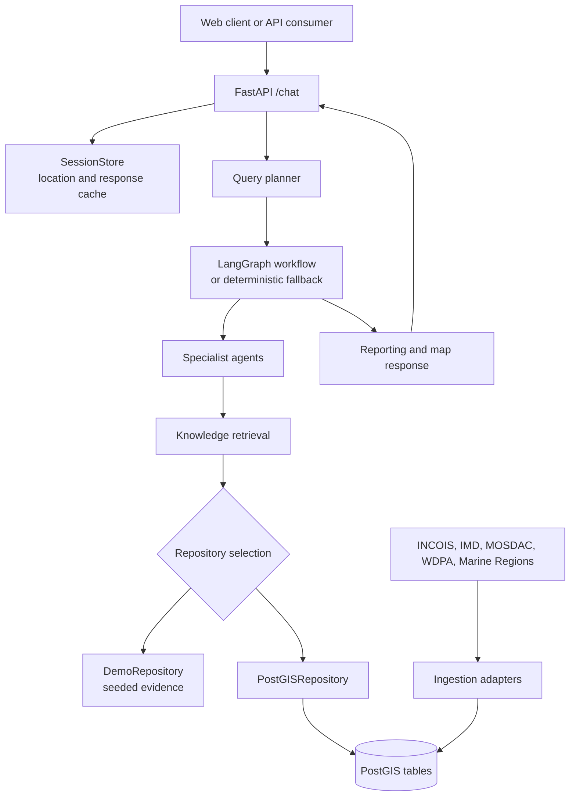

# Orca Marine Intelligence

Orca is an evidence-grounded marine intelligence API for the SIH26176 disaster-management brief. It combines potential fishing zone advisories, weather hazards, ocean-state forecasts, satellite readings, and maritime boundaries into traceable answers for fishing and coastal operations.

The project has two modes:

- **Demo mode** uses deterministic seeded evidence and runs without PostgreSQL or external APIs.
- **Live mode** reads normalized data from PostGIS. Ingestion jobs fetch machine-readable JSON/GeoJSON feeds and load them into the same tables used by retrieval.

The public portal URLs are catalogued for provenance, but portal HTML pages are not treated as data feeds. A live ingestion job needs the provider's actual API, JSON, GeoJSON, or export URL.

## Architecture



### Request flow

1. `POST /chat` validates the session, message, and optional latitude/longitude.
2. The session store reuses the last known location and returns cached responses when the normalized message and location match.
3. The planner selects specialist tasks from query terms such as `PFZ`, `weather`, `wave`, `chlorophyll`, `boundary`, `safe`, or `route`.
4. LangGraph runs the planning, specialist, risk, and reporting nodes in sequence. Set `ORCA_USE_LANGGRAPH=0` to use the deterministic runner.
5. Each specialist calls the retrieval contract. Configured PFZ, IMD, OSF, and satellite feeds are queried first with a short in-memory cache. Empty or failed feed reads fall back to PostGIS, then to seeded data when `ORCA_DEMO_MODE=1`.
6. The response includes text, confidence, evidence cards with source/table references, and a GeoJSON `FeatureCollection` containing the query location.

Empty live tables are valid: agents return an explicit no-data result with zero confidence instead of fabricating evidence or crashing.

### Specialist agents

| Agent | Responsibility | Main data |
| --- | --- | --- |
| `marine_data_discovery` | Find nearby PFZ advisories | `pfz_bulletins` |
| `weather_intelligence` | Find active alerts in the requested area and time window | `weather_alerts` |
| `ocean_analytics` | Retrieve waves, wind, currents, tides, or satellite trends | `ocean_state_forecast`, `satellite_readings` |
| `geospatial_reasoning` | Check PFZ proximity, MPA/EEZ boundaries, and route points | `pfz_bulletins`, `boundary_geometries` |
| `risk_assessment` | Combine available evidence into a caution or insufficient-evidence verdict | Previous agent results |
| `reporting` | Render the final answer and map payload | Previous agent results |

### Data model

The schema in `db/schema.sql` creates:

- `pfz_bulletins`: INCOIS PFZ geometry and advisory metadata.
- `weather_alerts`: IMD-style alert geometry, severity, validity, and description.
- `ocean_state_forecast`: point forecasts for waves, wind, currents, and tides.
- `satellite_readings`: point observations such as chlorophyll and SST.
- `boundary_geometries`: EEZ, MPA, and other geofencing geometries with JSON metadata.
- `evidence_cards`: reserved persistence structure for traceable response evidence.

Spatial queries use PostGIS geography/geometry indexes for nearest-neighbour, intersection, and distance operations.

## Run locally without Docker

```powershell
python -m pip install -e ".[dev]"
$env:ORCA_DEMO_MODE = "1"
$env:ORCA_DATABASE_URL = ""
python -m uvicorn orca.api.main:app --reload
```

This starts Orca in offline demo mode with seeded marine evidence. It does not require Docker, PostgreSQL, PostGIS, or external data feeds. Open `http://127.0.0.1:8000/docs` or call:

```powershell
Invoke-RestMethod http://127.0.0.1:8000/chat -Method Post -ContentType 'application/json' -Body '{"session_id":"demo","message":"Where is the nearest potential fishing zone today?"}'
```

Run the checks with:

```powershell
python -m pytest
```

Check runtime status at `http://127.0.0.1:8000/health`.

### Local SQLite archive

For persistent local data without Docker, initialize and use the SQLite backend:

```powershell
$env:ORCA_USE_SQLITE = "1"
$env:ORCA_SQLITE_PATH = "data/orca.sqlite3"
$env:ORCA_DEMO_MODE = "0"
$env:ORCA_DATABASE_URL = ""
python -m uvicorn orca.api.main:app --reload
```

Import real normalized historical JSON/GeoJSON archives for the Arabian Sea. Files are selected by prefix: `pfz*.json`, `weather*.json`, `ocean*.json`, `satellite*.json`, and `boundary*.json`.

```powershell
python -m ingestion.import_historic_sqlite `
	--input-dir data/arabian-sea `
	--db-path data/orca.sqlite3 `
	--start 2005-01-01
```

The importer defaults to `2005-01-01` through today, preserves source URLs and raw geometry, and rejects records outside the requested date window. The archive format is intentionally normalized so provider-specific downloads can be validated before loading.

## Frontend console

The operational console is a Next.js app in `frontend/`. Start it separately while the API is running:

```powershell
Set-Location frontend
npm install
npm run dev
```

Open `http://127.0.0.1:3000`. The console checks `/health`, sends questions to `/chat`, preserves a browser session, accepts manual or browser coordinates, and renders confidence plus evidence cards. It uses a maximalist solid-color visual system with no gradients. By default it calls `http://127.0.0.1:8000`; set `NEXT_PUBLIC_ORCA_API_URL` before `npm run dev` when the API runs elsewhere.

## Optional live stack

Use this only when you need persistent ingested data or spatial queries against live feeds. Install the application and live dependencies, then start PostgreSQL/PostGIS with Docker:

```powershell
python -m pip install -e ".[dev,live]"
docker compose up -d --build
```

The API container uses `ORCA_DEMO_MODE=0`, so it reads PostGIS and does not fabricate missing live data. The database is reachable by the app internally as `db:5432`; PostgreSQL is intentionally not published to the host by default. The API is available at `http://127.0.0.1:8000`.

Useful operational commands:

```powershell
docker compose ps
docker compose logs -f app db
docker compose exec -T db psql -U orca -d orca -c "SELECT PostGIS_Version();"
docker compose down
```

## Configuration

Copy `.env.example` to `.env` for local reference. Compose reads the values from the environment; it does not automatically load `.env` into the `app` service unless the variables are declared in the Compose file or exported in the shell.

| Variable | Purpose |
| --- | --- |
| `ORCA_DATABASE_URL` | PostgreSQL/PostGIS connection string. |
| `ORCA_DEMO_MODE` | Set `1` for seeded offline retrieval; set `0` for live PostGIS. |
| `ORCA_USE_LANGGRAPH` | Set `1` for LangGraph; set `0` for the deterministic fallback. |
| `ORCA_REQUEST_TIMEOUT` | HTTP timeout used by ingestion requests, in seconds. |
| `ORCA_FEED_CACHE_TTL` | Seconds to reuse a successful live feed response in the API process. |
| `ORCA_PFZ_FEED_URL` | Machine-readable PFZ feed used by the source dispatcher. |
| `ORCA_IMD_API_URL` | Selected IMD API or normalized alert feed endpoint. |
| `ORCA_IMD_API_KEY` | Optional IMD credential reserved for an authenticated adapter. |
| `ORCA_OSF_FEED_URL` | Machine-readable INCOIS OSF feed. |
| `ORCA_SATELLITE_FEED_URL` | Machine-readable MOSDAC/Oceansat reading feed. |
| `ORCA_MOSDAC_TOKEN` | Optional MOSDAC credential reserved for an authenticated adapter. |
| `ORCA_BOUNDARIES_FEED_URL` | EEZ/MPA GeoJSON export feed. |
| `ORCA_WDPA_TOKEN` | Optional Protected Planet/WDPA credential reserved for an authenticated adapter. |
| `GROQ_API_KEY`, `GROQ_MODEL` | Optional LLM settings; `/health` reports Groq only when the key is present. |

Configured IMD and MOSDAC tokens are sent as `Authorization: Bearer ...` headers by the live feed repository. Provider-specific authentication schemes may differ, so use a normalized authenticated endpoint when the upstream service does not accept bearer tokens. The generic ingestion commands remain intentionally provider-neutral.

## Ingestion pipeline

The source registry is in `ingestion/source_catalog.py`. It records the public source page, the normalized adapter, the feed environment variable, and licensing/access notes. The adapters are intentionally small and separate from orchestration:

| Command adapter | Normalized table |
| --- | --- |
| `pfz` | `pfz_bulletins` |
| `weather` | `weather_alerts` |
| `osf` | `ocean_state_forecast` |
| `satellite` | `satellite_readings` |
| `boundaries` | `boundary_geometries` |

Load a feed directly:

```powershell
python -m ingestion.ingest_pfz https://your-feed.example/pfz.geojson --database-url $env:ORCA_DATABASE_URL
python -m ingestion.ingest_weather https://your-feed.example/alerts.geojson --database-url $env:ORCA_DATABASE_URL
```

Or use the source dispatcher. `--url` overrides configuration; without it, the dispatcher uses the source's configured `ORCA_*_FEED_URL` value:

```powershell
python -m ingestion.ingest_source pfz_advisory --database-url $env:ORCA_DATABASE_URL
python -m ingestion.ingest_source imd_api --database-url $env:ORCA_DATABASE_URL
python -m ingestion.ingest_source incois_osf --database-url $env:ORCA_DATABASE_URL
python -m ingestion.ingest_source oceansat_open_data --database-url $env:ORCA_DATABASE_URL
```

PFZ, OSF, MOSDAC, IMD, Marine Regions, and WDPA portal pages are not themselves feed URLs. GEBCO is gridded raster data and needs a separate raster pipeline. WDPA data is suitable for a hackathon/academic demo but has commercial-use restrictions.

Each feed must match the fields expected by its normalizer. The current adapters accept JSON/GeoJSON and do not scrape interactive portals.

## API contract

### `GET /health`

Returns service status, data status (`demo`, `api-only`, `ok`, or `degraded`), and the selected LLM status.

### `POST /chat`

Request:

```json
{
	"session_id": "demo",
	"message": "Where is the nearest potential fishing zone today?",
	"lat": 15.10,
	"lon": 73.75
}
```

`lat` and `lon` are optional. A session's last location is reused when they are omitted; otherwise the default demo location is used.

Response fields include `response_text`, detected `lang`, `confidence`, `evidence`, and `map_data`. Evidence cards carry a type, content, source, validity time, and `raw_ref` pointing back to a database table or demo record.

Example:

```powershell
$body = '{"session_id":"demo","message":"What are the wave and weather conditions?","lat":15.10,"lon":73.75}'
Invoke-RestMethod http://127.0.0.1:8000/chat -Method Post -ContentType 'application/json' -Body $body | ConvertTo-Json -Depth 8
```

## Limitations and next steps

- Provider-specific authentication headers and response schemas still need dedicated adapters; the generic loaders require normalized JSON/GeoJSON.
- The live repository expects normalized JSON/GeoJSON fields; provider-specific response mapping still belongs in dedicated adapters.
- GEBCO bathymetry needs a raster ingestion and tile/query path.
- Exact India-Sri Lanka IMBL geometry is not bundled; Marine Regions EEZ boundaries are the current demo substitute.
- The frontend is a static operational console; the API remains the primary validated interface.

Run `python -m pytest` before changing adapters, orchestration, or retrieval contracts.
