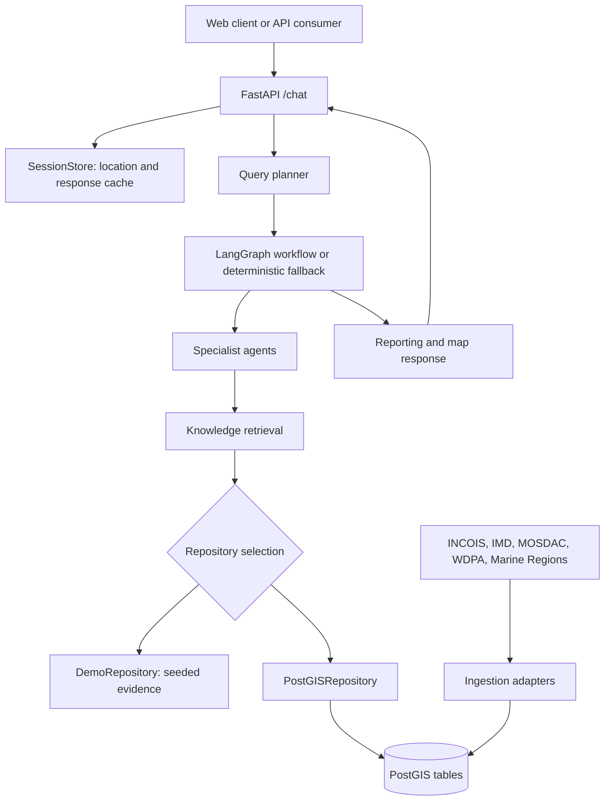

# ORCA — Marine Intelligence API

Evidence-grounded marine intelligence for coastal and fishing operations. ORCA combines potential fishing zone (PFZ) advisories, weather hazards, ocean-state forecasts, satellite readings, and maritime boundaries into a single traceable answer, instead of requiring users to cross-check multiple government data sources manually. Built for SIH problem statement 26176.

Full technical specification: [ARCHITECTURE.md](ARCHITECTURE.md). Data status and ingestion limitations: [DATA_PROVENANCE_AND_INGESTION.txt](DATA_PROVENANCE_AND_INGESTION.txt).

## Data status

ORCA runs locally on a SQLite evidence store populated with normalized historical demonstration fixtures. Retrieval, evidence, mapping, confidence scoring, and multi-agent reasoning are fully functional against this data. PostGIS and live provider ingestion (INCOIS, IMD, MOSDAC, WDPA, Marine Regions) are implemented but optional, and require configured credentials, network access, and independent verification before their output can be described as live. The API reports its current state via `mission_brief.provenance` and `mission_brief.provider_verification` on every response — treat those fields as authoritative, not the provider name alone.

## Architecture



### Request flow

1. `POST /chat` validates the session, message, and optional coordinates.
2. The session store reuses the last known location and returns a cached response when the normalized message and location match a prior query.
3. The planner selects specialist tasks from query terms (`PFZ`, `weather`, `wave`, `chlorophyll`, `boundary`, `safe`, `route`, etc.).
4. LangGraph runs the planning, specialist, risk, and reporting nodes in sequence (`ORCA_USE_LANGGRAPH=0` switches to a deterministic runner using the same agent and retrieval contracts).
5. Each specialist queries configured live feeds first (short in-memory cache), falling back to PostGIS, then to seeded SQLite data when `ORCA_DEMO_MODE=1`.
6. The reporting layer assembles one shared decision object: resolved location, eligible/excluded candidates, recommendation, confidence, risk decomposition, rationale, scenarios, coverage, and provenance.
7. The response returns a concise executive `response_text`, with full evidence, specialist trace, map data, and lineage available as structured fields for inspection.
8. Empty live tables are a valid outcome — agents return an explicit no-data, zero-confidence result rather than fabricating or crashing.

### Specialist agents

| Agent | Responsibility | Data |
| --- | --- | --- |
| `marine_data_discovery` | Nearby PFZ advisories | `pfz_bulletins` |
| `weather_intelligence` | Active alerts in the requested area and time window | `weather_alerts` |
| `ocean_analytics` | Waves, wind, currents, tides, satellite trends | `ocean_state_forecast`, `satellite_readings` |
| `geospatial_reasoning` | PFZ proximity, MPA/EEZ boundaries, route points | `pfz_bulletins`, `boundary_geometries` |
| `risk_assessment` | Combines evidence into a caution or insufficient-evidence verdict | Previous agent results |
| `reporting` | Renders the final answer and map payload | Previous agent results |

### Data model (`db/schema.sql`)

- `pfz_bulletins` — INCOIS PFZ geometry and advisory metadata
- `weather_alerts` — IMD-style alert geometry, severity, validity window, description
- `ocean_state_forecast` — wave, wind, current, and tide point forecasts
- `satellite_readings` — point observations (chlorophyll, SST)
- `boundary_geometries` — EEZ, MPA, and other geofencing geometry with JSON metadata
- `evidence_cards` — reserved persistence structure for traceable response evidence

Spatial queries use PostGIS geography/geometry indexes for nearest-neighbour, intersection, and distance operations.

## Quick start (local, no Docker)

```powershell
python -m pip install -e ".[dev]"
$env:ORCA_DEMO_MODE = "1"
$env:PYTHONPATH = "src;."
python -m uvicorn orca.api.main:app --reload
```

This runs ORCA in offline demo mode with seeded evidence — no Docker, PostgreSQL, PostGIS, or external feeds required. API docs: `http://127.0.0.1:8000/docs`. Runtime status: `http://127.0.0.1:8000/health`.

```powershell
Invoke-RestMethod http://127.0.0.1:8000/chat -Method Post -ContentType 'application/json' `
  -Body '{"session_id":"demo","message":"Where is the nearest potential fishing zone today?"}'
```

Run tests before changing adapters, orchestration, or retrieval contracts:

```powershell
python -m pytest
```

### Persistent local data (SQLite)

The checked-in database contains 72 normalized demonstration records (9 PFZ, 9 weather, 27 ocean, 18 satellite, 9 boundary). These exercise the real retrieval and decision pipeline but are not verified live provider observations — the API labels this state `DEMO FIXTURE` / `NOT LIVE VERIFIED`.

```powershell
$env:ORCA_USE_SQLITE = "1"
$env:ORCA_SQLITE_PATH = "data/orca.sqlite3"
$env:ORCA_DEMO_MODE = "0"
$env:PYTHONPATH = "src;."
python -m uvicorn orca.api.main:app --reload
```

Import normalized historical JSON/GeoJSON archives (files selected by prefix: `pfz*.json`, `weather*.json`, `ocean*.json`, `satellite*.json`, `boundary*.json`):

```powershell
python -m ingestion.import_historic_sqlite --input-dir data/arabian-sea --db-path data/orca.sqlite3 --start 2005-01-01
```

The importer preserves source URLs and raw geometry, and rejects records outside the requested date window.

## Frontend

A Next.js operational console lives in `frontend/`:

```powershell
cd frontend
npm install
npm run dev
```

Open `http://127.0.0.1:3000`. It checks `/health`, sends queries to `/chat`, preserves a browser session, accepts manual or browser-geolocated coordinates, and renders confidence and evidence cards. Set `NEXT_PUBLIC_ORCA_API_URL` before `npm run dev` if the API runs somewhere other than `http://127.0.0.1:8000`.

## Optional live stack (PostGIS)

Only needed for persistent ingested data or spatial queries against live feeds:

```powershell
python -m pip install -e ".[dev,live]"
docker compose up -d --build
```

`ORCA_DEMO_MODE=0` in the API container means it reads PostGIS directly and does not fabricate missing live data. PostgreSQL is reachable internally as `db:5432` and is not published to the host by default.

```powershell
docker compose ps
docker compose logs -f app db
docker compose exec -T db psql -U orca -d orca -c "SELECT PostGIS_Version();"
docker compose down
```

## Configuration

Copy `.env.example` to `.env` for reference — Compose does not load `.env` into the `app` service automatically unless the variables are declared in the Compose file or exported in the shell.

| Variable | Purpose |
| --- | --- |
| `ORCA_DATABASE_URL` | PostgreSQL/PostGIS connection string |
| `ORCA_DEMO_MODE` | `1` for seeded offline retrieval, `0` for live PostGIS |
| `ORCA_USE_LANGGRAPH` | `1` for LangGraph, `0` for the deterministic fallback |
| `ORCA_REQUEST_TIMEOUT` | Ingestion HTTP timeout (seconds) |
| `ORCA_FEED_CACHE_TTL` | Seconds to reuse a successful live feed response |
| `ORCA_PFZ_FEED_URL` | Machine-readable PFZ feed |
| `ORCA_IMD_API_URL` / `ORCA_IMD_API_KEY` | IMD API endpoint / credential |
| `ORCA_OSF_FEED_URL` | INCOIS ocean state forecast feed |
| `ORCA_SATELLITE_FEED_URL` / `ORCA_MOSDAC_TOKEN` | MOSDAC/Oceansat feed / credential |
| `ORCA_BOUNDARIES_FEED_URL` / `ORCA_WDPA_TOKEN` | EEZ/MPA GeoJSON feed / credential |
| `GROQ_API_KEY`, `GROQ_MODEL` | Optional LLM settings; `/health` reports Groq only when the key is present |

Configured IMD and MOSDAC tokens are sent as `Authorization: Bearer ...` headers. If a provider doesn't accept bearer tokens, use a normalized authenticated endpoint in front of it — the generic ingestion commands are intentionally provider-neutral.

## Ingestion

The source registry (`ingestion/source_catalog.py`) records each provider's public source page, normalized adapter, feed environment variable, and licensing/access notes.

| Command adapter | Table |
| --- | --- |
| `pfz` | `pfz_bulletins` |
| `weather` | `weather_alerts` |
| `osf` | `ocean_state_forecast` |
| `satellite` | `satellite_readings` |
| `boundaries` | `boundary_geometries` |

```powershell
python -m ingestion.ingest_pfz https://your-feed.example/pfz.geojson --database-url $env:ORCA_DATABASE_URL
python -m ingestion.ingest_source imd_api --database-url $env:ORCA_DATABASE_URL
```

`--url` overrides configuration; without it, the dispatcher uses the source's configured `ORCA_*_FEED_URL`. Adapters accept normalized JSON/GeoJSON only — public provider portal pages (INCOIS, IMD, MOSDAC, Marine Regions, WDPA) are not feed URLs and are not scraped. GEBCO bathymetry is gridded raster data requiring a separate pipeline. WDPA data is suitable for a hackathon/academic demo but carries commercial-use restrictions.

## API contract

**`GET /health`** — service status, data status (`demo`, `api-only`, `ok`, `degraded`), LLM status.

**`POST /chat`**

```json
{
  "session_id": "demo",
  "message": "Where is the nearest potential fishing zone today?",
  "lat": 15.10,
  "lon": 73.75
}
```

`lat`/`lon` are optional — a session's last location is reused when omitted, otherwise a default demo location is used.

Response fields:

| Field | Contents |
| --- | --- |
| `response_text` | Concise executive answer |
| `mission_brief` | Recommendation, confidence, risk, rationale, scenarios, boundary status, provenance |
| `resolved_location` | Authoritative coordinate resolution used downstream |
| `risk_decomposition` | Component risk values, primary driver, evidence-derived reasons |
| `evidence_coverage` | Available/missing domains, confidence limitations |
| `evidence` | Deduplicated source records with coordinates, validity, distance, `raw_ref` |
| `agent_trace` | Per-specialist contributions |
| `lineage` | Processing stages from query to synthesis |
| `map_data` | GeoJSON features for the query/evidence map |

Provider names in evidence do not imply live verification — check `mission_brief.provenance` and `mission_brief.provider_verification`.

```powershell
$body = '{"session_id":"demo","message":"What are the wave and weather conditions?","lat":15.10,"lon":73.75}'
Invoke-RestMethod http://127.0.0.1:8000/chat -Method Post -ContentType 'application/json' -Body $body | ConvertTo-Json -Depth 8
```

## Known limitations

- Provider-specific authentication and response schemas still need dedicated adapters beyond the generic normalized loaders.
- GEBCO bathymetry needs a raster ingestion and tile/query path.
- Exact India–Sri Lanka IMBL geometry is not bundled; Marine Regions EEZ boundaries are the current substitute.
- The frontend is a console for the API, not an independent source of truth — the API is the primary validated interface.